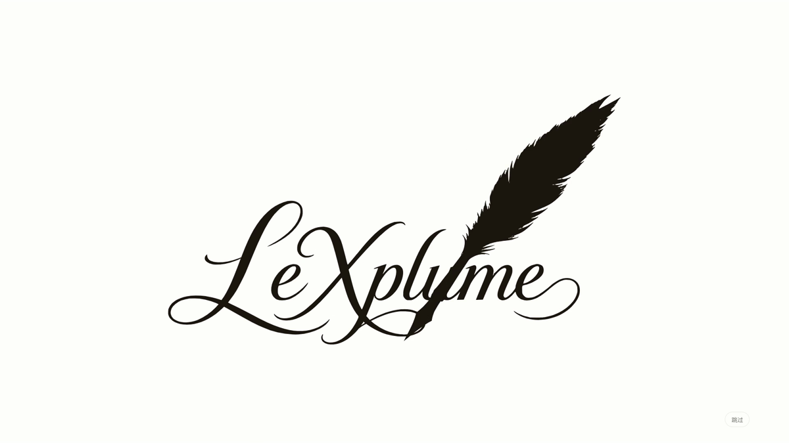

# LeXplume Handwriting Animation

A frame-driven Remotion recreation of the 3.37-second **Handwriting Animation** motion study: a feather writes the LeXplume wordmark, the ink drains back toward the nib, and the feather folds into the Semantic Fold logo.



## Run

```sh
npm ci
npm run dev
```

Open the Studio URL printed by the command and select **HandwritingAnimation**.

## Render

```sh
npm run render
# Output: out/handwriting-animation.mp4
npm run still
npm run lint
npm run typecheck
```

The default composition is **1920 × 1080, 30 fps, 101 frames**, with no audio (the reference audio track is silent). Rendering requires no external service or API key.

## Edit and remix

Change `backgroundColor`, `inkColor`, `durationSeconds`, or `showSkip` in the composition defaults in `src/Root.tsx`, or supply Remotion props:

```sh
npx remotion render src/index.ts HandwritingAnimation out/remix.mp4 --props='{"backgroundColor":"#f3f0e9","inkColor":"#29251e","durationSeconds":5,"showSkip":false}'
```

`src/Composition.tsx` builds the scene from editable SVG paths, masks and groups. `useCurrentFrame()` and `interpolate()` select and interpolate vector attributes and feather poses. It contains no GSAP runtime, CSS animation, video replay, or screenshot sequence.

`src/data/vector-scene.json` holds the sampled vector motion tracks from the original LeXplume animation. The original quill, writing path, wordmark and logo SVGs are included in `public/artwork/` as editable source material. These preserve the hand-drawn glyph and nib geometry precisely. Retiming the scene interpolates the existing vector tracks; replacing lettering requires corresponding replacement paths and masks.

## Provenance

- Product and brand artwork: [LeXplume](https://lexplume.com/).
- Motion Face recording: [Handwriting Animation](https://motionface.cc/?recording=88ad9830-075a-4017-a145-adfead5cbee3).
- Reference duration: 3.37 seconds. The composition stops at the formed logo, matching the uploaded clip.
- Signed download URLs, binding credentials, reference footage, local review files and rendered output are excluded from this repository.

Source is published for this motion study. The LeXplume name and brand artwork remain their owner's assets; no third-party trademark permission is implied.
